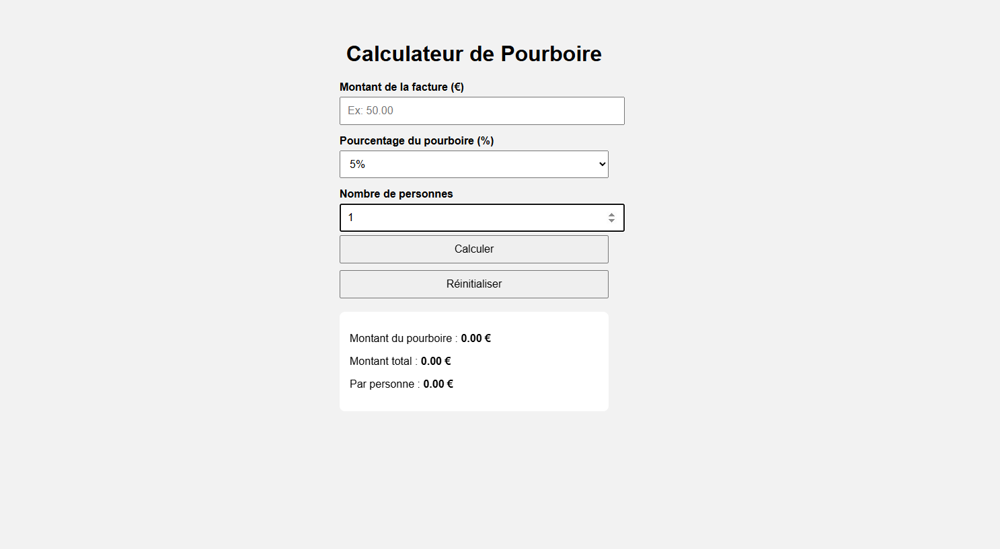

# Tip-Calculator

# 💰 Tip Calculator

A simple and interactive web application that helps users quickly calculate the tip amount based on the total bill and desired tip percentage.

---

## 📋 Overview

**Tip Calculator** is designed for users who want to:

- Easily calculate how much tip to leave in a restaurant or service scenario.
- Split the bill and tip among multiple people.
- Get quick and accurate results with a clean and responsive interface.

---

## 🚀 Features

✅ Enter bill amount  
✅ Choose or enter a custom tip percentage  
✅ Optional: Enter number of people to split the bill  
✅ View calculated tip amount and total per person  
✅ Instant calculation as values are entered or on button click  
✅ Clear/reset button to start over  
✅ Fully responsive on mobile and desktop

---

## 🛠️ Technologies Used

- 🌐 **HTML5** – Structure of the page
- 🎨 **CSS3 / Bootstrap 5** – Styling and responsive layout
- ⚙️ **JavaScript / jQuery** – Logic and interactivity

---

## 🔢 Example

- **Bill amount**: $100
- **Tip**: 15% → **$15**
- **Total**: $115
- **People**: 3 → **$38.33 each**

---

## 📸 Screenshot

_Add a screenshot of the application UI here_



## 🔗 Live Demo

👉 [Click here to try Tip Calculator](https://projectsjavascript.github.io/TipCalculator/)

## 📁 Project Structure

```
tip-calculator/
├── index.html
├── README.fr.md
├── script.js
├── screenshot.png
└── README.md

```

## 📄 License

This project is open-source and available under the MIT License.

### 🌐 Langue / Language

- 🇫🇷 [Lire en Français](./README.fr.md)
- 🇬🇧 [Read in English](./README.md)

```

```
